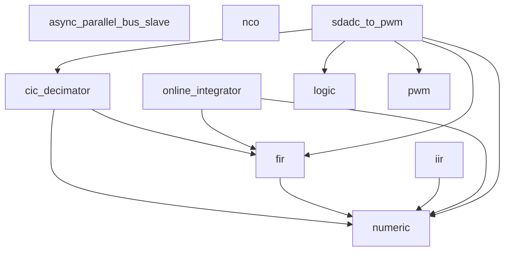

<h1>Kulibin HDL library</h1>

_reusable HDL modules_

---

Kulibin is a loose collection of reusable HDL modules.
Auxiliary Python scripts are provided for analysis and parameter derivation;
they commonly require NumPy, SciPy, SymPy, matplotlib.
Higher-level modules serve as usage examples for the lower-level ones.

## Verification

Each module is wrapped in a FuseSoC `.core` file. All testbenches are run locally with:

    make verify

which invokes `fusesoc run --target=sim[_<name>] zubax:kulibin:<module>` for every registered target.

See CI files in `.github/`.

<!-- hierarchy-start -->
## Module dependency graph

<!-- hierarchy-end -->
