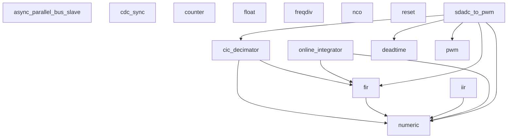

<h1>Kulibin HDL library</h1>

_reusable HDL modules_

---

Kulibin is a loose collection of reusable HDL modules.
Auxiliary Python scripts are provided for analysis and parameter derivation;
they commonly require NumPy, SciPy, SymPy, matplotlib.
Higher-level modules serve as usage examples for the lower-level ones.

## Verification

Each module is wrapped in a FuseSoC `.core` file.
All testbenches and validation synthesis targets are run locally with:

    make verify

A failed simulation, uncovered gated RTL line (where required), synthesis failure, or timing miss fails `make verify`.

For interactive use, prefer targeted module-specific verificaiton. For the floating point specifically, use

    make verify-float-fast

To simulate one specific target instead of the full library, run e.g.
`fusesoc run --target=sim_cic_decimator zubax:kulibin:cic_decimator` from the repository root.

### Tiered CI

The CI is composed of two tiers: ordinary fast verification for frequent use and deep verification.
Deep verification may take a very long time, potentially hours; it is not enabled for every commit.

To manually trigger deep verification of the float module, add `#ci-float` to the commit message.

### Synthesis evaluation

The default verification path runs only the required Yosys/nextpnr ECP5 synthesis flow:

    make synth-float-yosys-ecp5

This writes `build/float_synth_yosys_ecp5/index.html` and exits nonzero if any configured float module fails synthesis
or misses timing. The target frequency defaults to 100 MHz and can be overridden with `YOSYS_TARGET_FREQ_MHZ`.

To run all available synthesis flows manually:

    make synth-float

This runs the required Yosys/nextpnr ECP5 flow and also runs Diamond/LSE if the Diamond tools are available. Diamond can
be run explicitly with `make synth-float-diamond-ecp5`; its report is written to
`build/float_synth_diamond_ecp5/index.html` and it is intentionally not part of default verification because Diamond may
be unavailable.

An optional second open-source data point on AMD/Xilinx fabric is available via Yosys + nextpnr-xilinx, targeting the
Spartan-7 `xc7s50csga324-1` (the smallest part the open prjxray/nextpnr-xilinx flow supports) at the slowest speed
grade:

    make synth-float-yosys-spartan7

It writes `build/float_synth_yosys_spartan7/index.html`. On first use it builds and caches the nextpnr-xilinx chip
database for the fixed default part. This flow is optional and non-fatal: it skips cleanly when nextpnr-xilinx / bbasm /
the prjxray database are unavailable, and a synthesis or timing failure never fails the build. It is therefore excluded
from the per-PR gate and runs only on the deep-verification path.

<!-- hierarchy-start -->
## Module dependency graph

```mermaid
graph TD
    %% auto-generated by hierarchy.py — do not edit
    async_parallel_bus_slave
    cdc_sync
    cic_decimator --> fir
    cic_decimator --> numeric
    counter
    fir --> numeric
    float
    freqdiv
    iir --> numeric
    nco
    online_integrator --> fir
    online_integrator --> numeric
    reset
    sdadc_to_pwm --> cic_decimator
    sdadc_to_pwm --> deadtime
    sdadc_to_pwm --> fir
    sdadc_to_pwm --> numeric
    sdadc_to_pwm --> pwm
```
<!-- hierarchy-end -->
