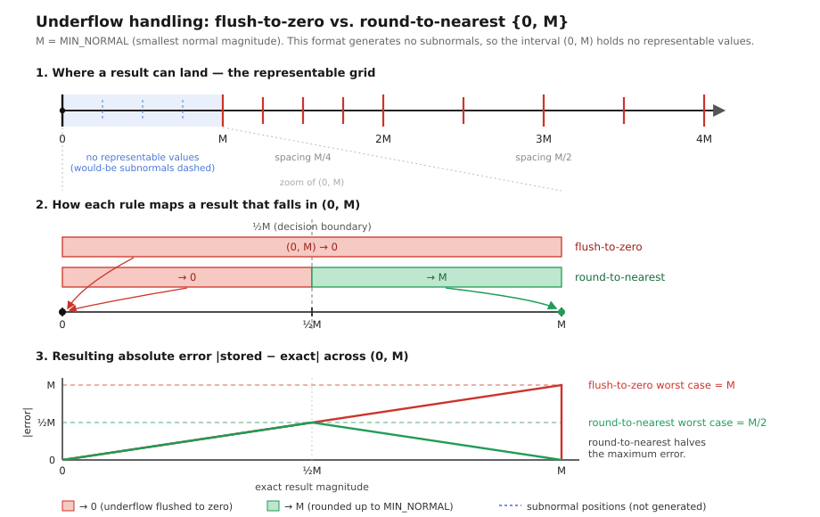
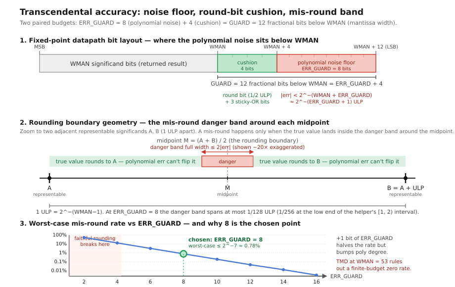

# Zubax Kuibin floating point

A small and FPGA-friendly floating point format that is similar to IEEE 754 but intentionally omits support for NaN,
subnormals, exceptions, and rounding modes other than round-to-nearest, ties-to-even.
Only one canonical positive zero representation exists.

The bit layout is identical to IEEE 754: sign, exponent, and the significand with the MSb omitted.
See `zkf.py` for the encoding rules and range/precision limits.

See how ZKF beats other floating-point libraries in <https://zubax.github.io/fpga-floating-point-eval>.

## Usage

The `zkf_*` modules located under `hdl/` implement various operators.
Unless specified otherwise, all modules are zero-bubble throughput-1 pipelines.

The two main parameters are WEXP and WMAN setting the bit width of the biased exponent and the significand;
the most significant bit of the significand is not stored, but there is a sign bit,
so the total bit width is simply WFULL=WEXP+WMAN.

The modules are entirely self-contained -- no external dependencies; simply drag-and-drop the directory into your project.
There are private helper modules named `_zkf_*`;
they are not supposed to be instantiated by the user but the public modules depend on them.
They do not offer any of the guarantees that are valid for the public modules.

Some of the simple combinational modules may produce non-canonical outputs; this does not affect compatibility with
other modules since they always canonicalize inputs, but it is worth noting.

### Latency tuning knobs

Most modules provide pipelining knobs, like output register selection, internal registers, etc,
to enable tuning for the target chip. Common options seen in most modules are:
`STAGE_INPUT` -- latch inputs (no combinational paths at the input);
`STAGE_OUTPUT` -- registered outputs (no combinational paths at the output);
others control various computation stages.

Some modules offer to split long multiplication into several stages via `STAGE_PRODUCT`;
sometimes it helps, but sometimes it prevents the synthesizer from mapping the product do DSP slices,
worsening the performance.
Thus the effect of each knob has to be evaluated empirically against the specific flow and its settings.

Every sequential module exposes a `LATENCY` parameter that defaults to the module's exact register-stage count
for the current configuration. It is not a tuning knob -- changing it does not change the hardware. Its purpose is
to let a latency-sensitive consumer pin down the latency it relies on: compute the value locally and pass it in.
The module fails synthesis if the supplied value disagrees with its real stage count, so an internal change that shifts
the latency cannot slip through unnoticed -- the build breaks and points you at the stale constant.
Pair `LATENCY` with `zkf_pipe` to delay your own control or sideband signals so they land with the operator's output.

The `LATENCY` value is a sum of some constant baseline number of stages,
plus optionally some WMAN-dependent stage count, plus the sum of all `STAGE_*` values (all zero by default).

### Catalogue

Notation: ⇝ - combinational, ⇻ - sequential, (nothing) - can be either depending on the selected `STAGE_`s.

| Module                |   | Function                                                       | Remarks                     |
|-----------------------|---|----------------------------------------------------------------|-----------------------------|
| `zkf_abs`             | ⇝ | Absolute value.                                                |                             |
| `zkf_neg`             | ⇝ | Negation.                                                      | May produce -0 (non-canonical)|
| `zkf_is_finite`       | ⇝ | True iff `x` is finite.                                        |                             |
| `zkf_saturate`        | ⇝ | Replace ±∞ with the nearest finite of the same sign.           | Does not canonicalize       |
| `zkf_cmp`             | ⇻ | Compare two values.                                            |                             |
| `zkf_sort`            | ⇻ | Min and max of two values.                                     |                             |
| `zkf_add`             | ⇻ | `a + b`.                                                       |                             |
| `zkf_addsub`          | ⇻ | `a + b` or `a − b` selected by `op_sub` (trivial wrapper).     |                             |
| `zkf_mul`             | ⇻ | `a × b`.                                                       |                             |
| `zkf_mul_ilog2_const` | ⇻ | `a × 2^K` for a elaboration-time signed integer `K`.           |                             |
| `zkf_div`             | ⇻ | `a ÷ b`; flags divide-by-zero.                                 |                             |
| `zkf_fma`             | ⇻ | `(a × b) + c` fused multiply-add, high precision, rounded once.| Larger than separate mul->add; non-finite handling follows mul->add.|
| `zkf_from_int`        | ⇻ | Cast signed two's-complement integer to float.                 |                             |
| `zkf_to_int`          | ⇻ | Cast float to signed two's-complement integer with saturation. |                             |
| `zkf_resize`          |   | Cast between different float formats.                          |                             |
| `zkf_exp2`            | ⇻ | `2**x`                                                         | Faithful rounding, see below|
| `zkf_log2`            | ⇻ | `log2(x)`; `domain_error` if `x<0`, `pole` if `x=0`.           | Faithful rounding, see below|
| `zkf_pipe`            |   | Delay line of N register stages, W bits each.                  | No-op                       |

### Notably absent modules

The following modules are expected to appear because they are the missing primitives needed to access a huge variety
of transcendental and trigonometric functions:
`zkf_sincos` (maybe `zkf_sincos_phase(phi)` for some fixed-point phase modulo 1), `zkf_atan2`.
Also, modulo-pi range reduction is needed for basic trig operators.
From these we get:

    exp(x)      = exp2(x * log2(e))
    log_b(x)    = log2(x) / log2(b)
    pow(a,b)    = exp2(b * log2(a))
    sqrt(x)     = exp2(log2(x) * 2^-1)

    tan(x)      = sin(x) / cos(x)
    atan(x)     = atan2(x, 1)
    asin(x)     = atan2(x, sqrt(1 - x*x))
    acos(x)     = atan2(sqrt(1 - x*x), x)

And so on.

Generic floating-point remainder/modulo computation is not included because the general solution requires iterative
range reduction which maps poorly onto fixed-latency FPGA cores; instead, one can build the iterative solver using
the existing basic operators: zkf_fma, zkf_div, etc.

## Semantics

Differences from IEEE 754: no NaN, no subnormals (exponent 0 always encodes +0; finite magnitudes in `(0, min_normal/2)`
round to +0; magnitudes in `[min_normal/2, min_normal)` round to signed min_normal), no −0, no exceptions,
overflow produces ±∞.

Infinity cases that would be NaN in IEEE 754:

| Expression          | Result                         |
|---------------------|--------------------------------|
| +∞ + −∞             | +0                             |
| 0 · ±∞              | +0                             |
| 0 ÷ 0               | +0                             |
| ±∞ ÷ ±∞             | +0                             |

Non-NaN infinity cases (same intent as IEEE 754):

| Expression          | Result                         |
|---------------------|--------------------------------|
| finite ÷ 0          | ±∞  (sign = sign of dividend)  |
| ±∞ ÷ 0              | ±∞  (sign = sign of dividend)  |
| finite ÷ ±∞         | +0                             |
| ±∞ · ±∞             | ±∞  (sign = signs XOR)         |
| finite≠0 · ±∞       | ±∞  (sign = signs XOR)         |

The subnormal round-to-nearest behavior is illustrated below, compared against the basic flush to zero for any value
below the min normal. The timing/area cost of both approaches is approximately equivalent while the rounding method
halves the worst-case error.

### Accuracy of the transcendental functions

The exp2 and log2 transcendentals deliver faithful rounding (≤1 ULP guaranteed) with a 0.5 ULP correctly-rounded target,
enforced by two paired headroom budgets.

The per-segment Chebyshev fit + truncating Horner is sized to clear `< 2^-(WMAN+ERR_GUARD)` relative error with
ERR_GUARD = 8, i.e. between `2^-(ERR_GUARD+1) = 1/512` and `2^-ERR_GUARD = 1/256` of an ULP absolute across the
helper's `[1, 2)` interval — small enough that the round bit is structurally trustworthy,
so faithful rounding is automatic.

A mis-round against round-to-nearest-ties-to-even is possible only when the true value lies within `≈2^-(ERR_GUARD-1)`
ULP of a midpoint between adjacent representable values, bounding the worst-case mis-round rate at `≈2^-7 ≈ 0.8%`;
raising ERR_GUARD by one bit halves that rate at the cost of bumping the polynomial degree (and a Horner stage)
at some WMAN, but the Table-Maker's Dilemma rules out correctly-rounded-everywhere at WMAN = 53 regardless of budget,
so the 0.5 ULP target is best-effort while the ≤ 1 ULP bound is the hard contract.

The fixed-point datapath then carries GUARD = ERR_GUARD + 4 = 12 extra fractional bits below the WMAN significand
— eight bits of polynomial-noise headroom plus four bits to host the guard/round/sticky positions and absorb the
truncating Horner's LSB noise — which is the smallest split that keeps the round bit clear of the noise floor under
truncating arithmetic; widening it further has no accuracy benefit and just pays in DSP/LUT/FF area.

## Sizing the exponent and the significand (WEXP/WMAN)

WEXP can be chosen freely depending on the required range, while WMAN is sensitive to the chip's DSP capabilities
and thus requires careful selection to achieve best resource utilization.

|WMAN |≈ε (interval)| Description                                                                                 |
|-----|-------------|---------------------------------------------------------------------------------------------|
|  11 | 9.766e-04   | IEEE 754 binary16                                                                           |
|  16 | 3.052e-05   | DSP tiles in Lattice iCE40 and similar                                                      |
|  18 | 7.629e-06   | Classic FPGA DSP width, very common: ECP5, PolarFire, Trion, many Intel modes, etc.         |
|  24 | 1.192e-07   | IEEE 754 binary32; also fits Versal DSP58's 27x24 asymmetric multiplier side                |
|  27 | 1.490e-08   | Intel/Altera variable-precision DSPs                                                        |
|  36 | 2.910e-11   | 2x18 (very common) or native Intel/Altera 36x36-style variable-precision mode               |
|  48 | 7.105e-15   | 2x24 or 3x16; with an 8-bit exponent amounts to 7 bytes exactly                             |
|  53 | 2.220e-16   | IEEE 754 binary64                                                                           |

### WMAN=18

An FPGA-friendly format because modern DSP-enabled FPGAs often implement 18x18 bit multipliers, which means that a
narrower mantissa is unlikely to save much resources or nontrivially improve timings as long as hardware multipliers
are used.

One can stay within 24 bits total by choosing WEXP=6:

    WEXP=6 WMAN=18 WFRAC=17 WFULL=24 BIAS=31
    lowest     = 1/1073741824 ≈ 9.313e-10
    max        = 0xFFFF_C000  ≈ 4.295e+09
    ε          = 1/131072     ≈ 7.629e-06

### WMAN=36

Similar to the above, WMAN=36 is efficient on common FPGAs because it maps multiplication to four 18x18 DSP slices.
This is often a better fit for intermediate result representation to avoid error accumulation --
the precision lands halfway between IEEE 754 binary64 and binary32.

Usually, on an 18x18 DSP chip, going even a single bit higher causes f_max to tank dramatically while area explodes.
Thus this is likely to be the optimal choice for a large number of applications.

Using binary32-compatible exponent WEXP=8, 44 bits total (5.5 bytes):

    WEXP=8 WMAN=36 WFRAC=35 WFULL=44 BIAS=127
    lowest     = 1/85070591730234615865843651857942052864 ≈ 1.175e-38
    max        = 0xFFFFFFFF_F0000000_00000000_00000000    ≈ 3.403e+38
    ε          = 1/34359738368                            ≈ 2.910e-11

### IEEE 754-like

ZKF offers limited compatibility with IEEE 754 so while it can match the bit layout,
not all states are mappable between the formats.

- WEXP=5  WMAN=11: IEEE 754 binary16-like
- WEXP=8  WMAN=24: IEEE 754 binary32-like
- WEXP=11 WMAN=53: IEEE 754 binary64-like
